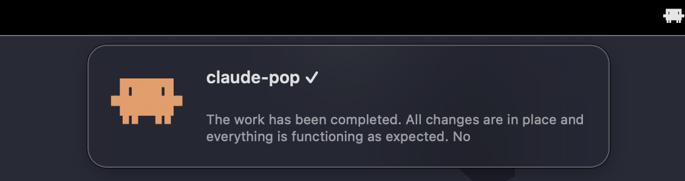

# claude-pop

```
 ▐▛███▜▌
▝▜█████▛▘
  ▘▘ ▝▝
```

macOS overlay notification for Claude Code. Floating toast at top-center when tasks complete.



## Install

```bash
brew install --cask esc5221/tap/claude-pop
```

Or download the DMG from [Releases](https://github.com/esc5221/claude-pop/releases).

## Setup

1. Launch the app — it sits in your menu bar
2. Add the Stop hook to `~/.claude/settings.json`:

```json
{
  "hooks": {
    "Stop": [
      {
        "matcher": "",
        "hooks": [
          {
            "type": "command",
            "command": "/path/to/claude-pop-hook.sh",
            "timeout": 10
          }
        ]
      }
    ]
  }
}
```

3. Hook script (`claude-pop-hook.sh`):

```bash
#!/bin/bash
INPUT=$(cat)
CWD=$(echo "$INPUT" | python3 -c "import sys,json; print(json.load(sys.stdin).get('cwd',''))" 2>/dev/null)
TRANSCRIPT=$(echo "$INPUT" | python3 -c "import sys,json; print(json.load(sys.stdin).get('transcript_path',''))" 2>/dev/null)

PROJECT=$(basename "$CWD" 2>/dev/null)
[ -z "$PROJECT" ] && PROJECT="claude"

PREVIEW=""
if [ -n "$TRANSCRIPT" ] && [ -f "$TRANSCRIPT" ]; then
    PREVIEW=$(grep '"type":"assistant"' "$TRANSCRIPT" | tail -1 | python3 -c "
import sys, json
try:
    line = json.loads(sys.stdin.readline())
    for block in line.get('message',{}).get('content',[]):
        if isinstance(block, dict) and block.get('type') == 'text':
            print(' '.join(block['text'].strip().split())[:100]); break
except: pass
" 2>/dev/null)
fi

claude-pop --project "$PROJECT" --cwd "$CWD" --response "$PREVIEW" &
```

## CLI

```bash
claude-pop --project "myapp" --response "Build finished"
claude-pop --project "myapp" --duration 5
claude-pop --daemon    # run as menu bar app (auto when launched from .app)
```

## Menu Bar

Click the menu bar icon to configure:

- **Title Template** — default: `{project} ✓`
- **Description Template** — default: `{response}`
- **Duration** — default: 3s
- **Reset to Defaults**
- **Launch at Login**

Available placeholders: `{project}`, `{cwd}`, `{response}`

## Build from source

```bash
git clone https://github.com/esc5221/claude-pop.git
cd claude-pop
./build.sh
open "build/Claude Pop.app"
```

## Requirements

- macOS 13.0+ (Ventura)
- Apple Silicon (arm64)

## License

MIT
